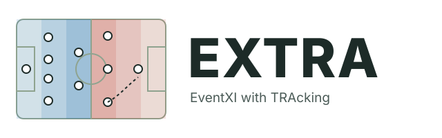
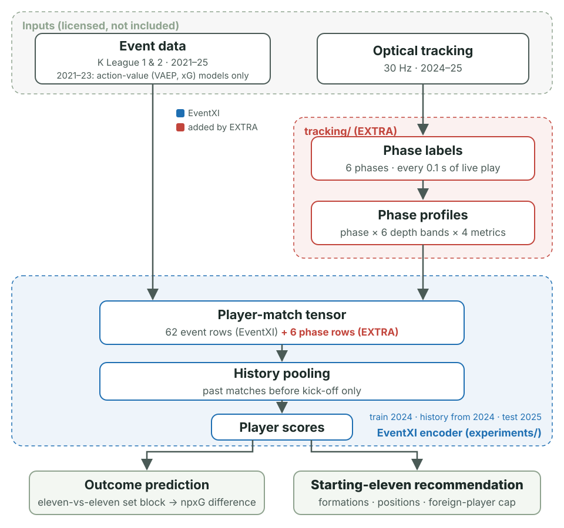
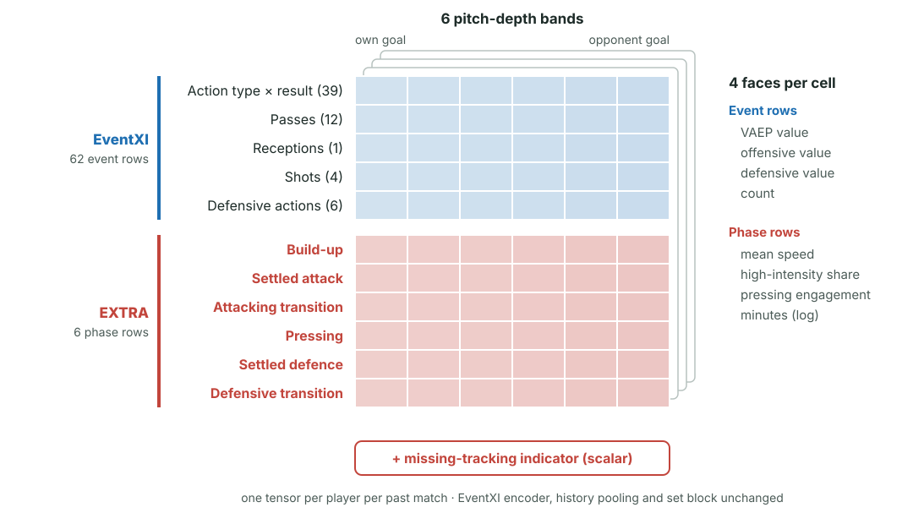
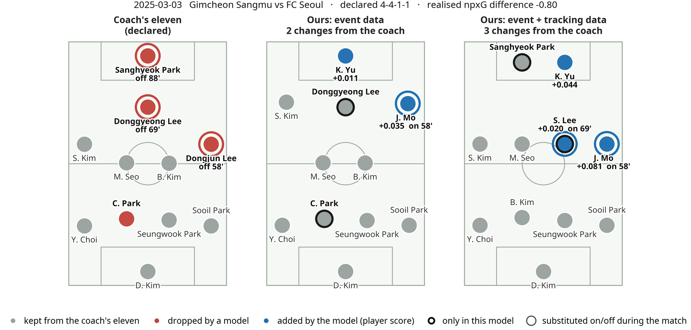

<div align="center">



## Recommending the Starting Eleven from Event and Tracking Data in Soccer

*Code name: EXTRA (EventXI with TRAcking)*

**EXTRA (EventXI with TRAcking) turns the optical tracking that clubs already collect into a pre-match input for choosing the starting eleven.**

[](#license)
[](https://www.python.org/)
[](https://pytorch.org/)
[](#citation)
[](#data-availability)

[Why EXTRA](#why-extra) · [Applications](#applications) · [Features](#features) · [Architecture](#architecture) · [Extension](#how-extra-extends-eventxi) · [Results](#results) · [Phases](#phase-definitions) · [Install](#installation) · [Reproduce](#reproducing-the-abstract) · [Layout](#repository-layout) · [Roadmap](#roadmap) · [Citation](#citation)

</div>

---

Clubs choose a starting eleven every match, and the choice is **counterfactual by nature**:
staff must judge elevens that have never played together. Clubs now record optical tracking,
yet published lineup models mostly rate players from on-ball events and miss the off-ball
work that changes with the phase of play.

This repository holds a lineup recommender that learns from both sources:

- **Event data** tells the recommender what each candidate adds **on the ball** in each pitch zone.
- **Tracking** tells it whether the eleven covers the **off-ball work** each phase demands —
  pressing, holding the line, recovering in transition.

The model scores every squad member from their own past matches, so it can evaluate
elevens that never played together; the same scores drive a constrained recommender
whose output staff review before kick-off. In the code, the event-only model is
**EventXI** and the event + tracking model is **EXTRA**.

## Why EXTRA

| | Ours: event data (EventXI) | **Ours: event + tracking data (EXTRA)** |
|---|---|---|
| Player evidence | Event channels × pitch-depth bands, pooled over each player's past matches | EventXI **+ phase-organised tracking profiles** |
| Off-ball work | Not seen | Speed, high-intensity share, pressing engagement and time, per phase and depth band |
| Output | Outcome prediction from the two elevens + constrained starting-eleven recommendation | Same, with tracking in every player score |
| Data needed | Event data | Event data + one season of tracking (as in our experiments); the few matches without tracking are flagged |
| Staff view | Recommended eleven and player scores | Recommended eleven, player scores **and phase profiles** |

## Applications

- **Pre-match selection** — compare the planned eleven with the recommendation and review each proposed change with its player score and phase profile.
- **Player recruitment** — search for players by phase-specific work, e.g. who presses and who recovers in transition.
- **Opponent-specific tactical adjustment** — weight phase profiles by the phase mix expected against a given opponent (roadmap).
- **Simulation-based coaching** — compare counterfactual elevens before a match.

Recommendations are evaluated here through outcome prediction and an illustrative case;
a recommendation-level evaluation (score gap against the fielded eleven with a
previous-eleven placebo) is on the roadmap.

## Features

- **Phase labels from tracking** — every 0.1 s of live play with a clear team in possession is labelled as build-up, settled attack, attacking transition, pressing, settled defence or defensive transition.
- **Phase profiles per player** — for each phase and each of six pitch-depth bands: time spent, mean speed, high-intensity share (> 5.5 m/s) and pressing engagement.
- **Drop-in for EventXI** — the six profiles become six new rows of EventXI's player-match tensor (`TRK=1 TRKMODE=phase`); a missing-tracking indicator covers matches without tracking.
- **One-season training window** — `TRAINFROM` and `HISTFROM` restrict training matches and player histories to seasons with tracking, so no zero-filled history enters the model.
- **Leakage-safe evaluation** — the 2025 season is held out; player histories use only matches strictly before the target match; a paired match bootstrap gives the uncertainty.
- **Case-study tooling** — lineup solver, case scan and the three-panel figure (coach's eleven, EventXI, EXTRA).

## Architecture

<p align="center">
  
</p>

Blue parts come from EventXI; red parts are what EXTRA adds. Tracking is turned into
phase labels and per-player phase profiles, which enter EventXI's player-match tensor;
everything downstream — history pooling, player scores, the eleven-vs-eleven set block
and the recommender — is EventXI's, so the tracking information reaches every player
score and the recommended eleven.

## How EXTRA extends EventXI

<p align="center">
  
</p>

EventXI describes each past match of a player as a tensor: **62 event rows × 6 pitch-depth
bands × 4 faces** (VAEP value, offensive value, defensive value, count; the pass,
reception, shot and defensive-action rows carry value and count only), alongside an
8 × 12 zone map and a block of scalar features. EXTRA appends
**six phase rows** — one per phase of play — on the same depth bands, with the faces
mean speed, high-intensity share, pressing engagement and minutes, plus a scalar
missing-tracking indicator in the scalar block. Nothing else in the model changes:
switching `TRK=1 TRKMODE=phase` on (with EventXI's `FULLCH=1`) turns EventXI into EXTRA.

## Results

2025 season held out (982 team-matches); models trained on 2024 with player
histories from 2024 on; five-seed averages.

| Model | Out-of-sample R² (npxG difference) |
|---|---|
| Season and venue only | 0.049 |
| Past minutes sum of the fielded eleven | 0.051 |
| Past VAEP sum of the fielded eleven | 0.081 |
| Linear model, event features | 0.144 |
| Ours, event data (EventXI) | 0.162 |
| **Ours, event + tracking data (EXTRA)** | **0.177** |

The baselines score the coach's fielded eleven: the season-and-venue intercept alone, and the
summed past minutes or past VAEP of the eleven. Adding tracking improves on the event-only model
by +0.015 R², a 9% relative gain (positive in 90% of 2,000 paired match-bootstrap resamples; the
95% interval, [−0.006, +0.038], still includes zero). Across 741 outfield players, even within the same position the players
with the highest high-intensity share in the attacking phases are largely different
from those with the highest share in the pressing phase (rank correlations 0.16–0.17).

<p align="center">
  
</p>

**Case study** — Incheon United vs Seongnam FC, 12 October 2025: the coach's
declared eleven (left) and our recommendations from event data (middle) and from event and
tracking data (right), from the same squad and constraints. Blue: added (player score); red:
dropped; black outline: one model only; rings mark players substituted on or off, with the
minute. An illustrative example, not evidence of better substitution prediction.

## Phase definitions

| Phase | Rule (team perspective, 10 Hz) |
|---|---|
| Build-up | Own possession, ball in the first 40% of the pitch in the attacking direction |
| Settled attack | Other own possession |
| Attacking transition | 5 s after winning the ball in play (not after a restart) |
| Pressing | Opponent possession; two or more players within 10 m of the ball, at least one closing at over 3 m/s |
| Settled defence | Other opponent possession |
| Defensive transition | 5 s after losing the ball in play |

Frames with the ball out of play or no clear team in possession are not labelled.

## Installation

```bash
git clone https://github.com/mself8/Recommending-the-Starting-Eleven-from-Event-and-Tracking-Data-in-Soccer.git
cd Recommending-the-Starting-Eleven-from-Event-and-Tracking-Data-in-Soccer
python -m venv .venv && source .venv/bin/activate
pip install -r vaep/requirements.txt "torch>=2.0" scipy
# the case-study figure uses the Noto Sans font (e.g. apt install fonts-noto-core)
git config core.hooksPath .githooks   # blocks data files from being committed
```

## Reproducing the abstract

Run from the repository root. Licensed inputs are located with `TRACKING_DIR`
(per-match `tracking.parquet` / `lineup.json`) and `MATCH_INFO_DIR` (`info.json` with
pitch size); EventXI's own inputs are described in [README_EventXI.md](README_EventXI.md).
GPU ids in `tracking/*.sh` are set with `GPU_A`, `GPU_B`, `GPU_C`.

```bash
bash scripts/01_features.sh                 # EventXI: events -> SPADL/VAEP -> player-match features
python tracking/phase_tables.py             # phase labels and player/team phase tables
python tracking/trk_channels.py             # phase profiles -> outputs/trk_channels.parquet
python tracking/phase_descriptives.py       # phase shares, reliability, within-position rank correlations

bash tracking/run_eventxi_arms.sh           # EventXI vs EXTRA trained on 2021-24 (comparison)
python tracking/eval_arms.py
bash tracking/run_eventxi_2024only.sh       # EventXI vs EXTRA, train 2024 / test 2025, 5 seeds
python tracking/eval_2024only.py            # Table 1 (TRAINFROM=2024 HISTFROM=2024)
python tracking/baselines_2024only.py        # Table 1 naive baselines (season/venue, past minutes, past VAEP)

python case_study/prepare_lineup_cases.py   # announced squads, past-only positions
python case_study/score_lineup.py event --h24 --limit 1000
python case_study/score_lineup.py phase --h24 --limit 1000
SUF=_h24 python case_study/scan_coach_cases.py 0 1
SUF=_h24 python case_study/coach_case_figure.py --pin 165733:4646   # case-study figure
```

**Reproducibility status.** The EXTRA stages — tracking tables, training, evaluation and
the case study — run from the outputs of the EventXI feature stage. The EventXI feature
stage itself (`scripts/01_features.sh`) does not yet regenerate every intermediate file
from raw data: a few inputs (raw lineup extraction, player-ID bridge seed files, a merged
goalkeeper feature table and the pre-match VAEP source table) have no producer script in
this release, and some steps need reordering. These are listed in the roadmap and will be
fixed in a later release.

| Abstract | Script |
|---|---|
| Table 1 (2025 held-out R²) | `tracking/eval_2024only.py`, `tracking/baselines_2024only.py` |
| Within-position rank correlations | `tracking/phase_descriptives.py` |
| Figure 1 (case study) | `case_study/coach_case_figure.py` |
| All three, in one place | [`notebooks/reproduce_abstract.ipynb`](notebooks/reproduce_abstract.ipynb) |

## Data availability

**No data are included.** The K League event, lineup and tracking data are licensed from
the league's official data provider and cannot be redistributed. The repository contains
no raw, intermediate or final data and no model checkpoints; `.gitignore` and
`.githooks/pre-commit` block them from being committed. The scripts document the expected
inputs so that the pipeline can be run on equivalent data.

## Repository layout

```
experiments/  gnn/  scripts/  vaep/   EventXI (README_EventXI.md) + TRK / TRAINFROM / HISTFROM options
tracking/     phase labels, phase profiles, descriptive statistics, training runs, evaluation
case_study/   player scores, lineup solver, case scan, case-study figure
notebooks/    reproduce_abstract.ipynb — Table 1, rank correlations and the case-study figure
docs/assets/  logo and README figure
```

Comments and docstrings are partly in Korean.

## Roadmap

- Bring seasons without tracking back into training with a learned missing-data model.
- Weight phase profiles by the phase mix a team is expected to play against a given opponent.
- Evaluate recommended elevens against match outcomes: score gap between the recommended and fielded eleven, with a previous-eleven placebo and simple selection rules (past minutes, past VAEP).
- Align the case-study recommender with the EventXI paper's settings (formation prior, score rescaling).
- Make `scripts/01_features.sh` run end to end from raw data: add producers for the raw lineup table, the player-ID bridge seeds, the merged goalkeeper features and the pre-match VAEP source table; fix the step order; freeze the scraped roster cache.

## Citation

SSAC 2027 Research Paper Competition, abstract under review. Citation details will be
added after review.

## License

Code: MIT, as for EventXI. The data are not covered.
